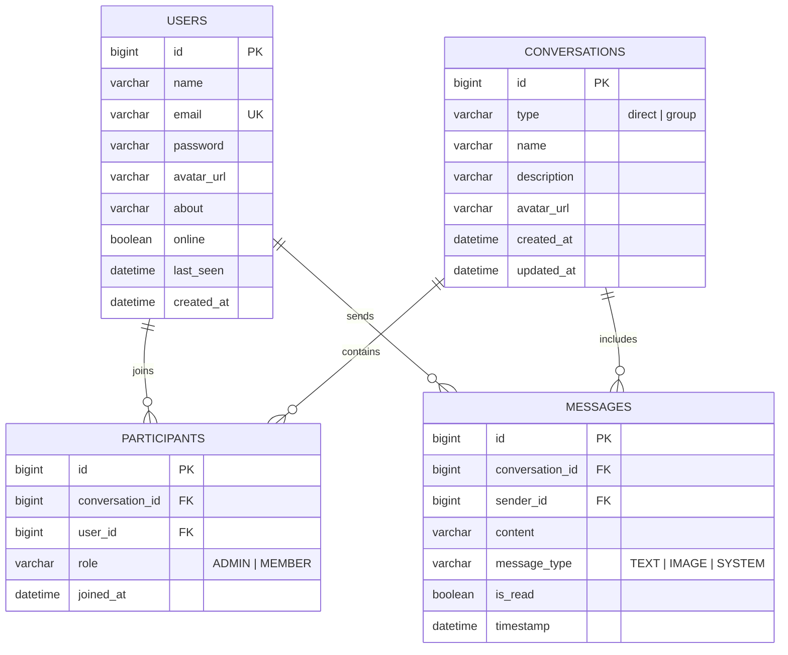

# 💬 ChatSphere — Full-Stack Real-Time Messaging Platform


> **ChatSphere** is a modern, high-performance, full-stack real-time chat application inspired by WhatsApp Web. Engineered with **Spring Boot 3**, **STOMP WebSockets**, **Spring Data JPA**, **MySQL**, and **React (Vite + Tailwind CSS)**.

---

## 🚀 Live Demo & Deployment Links

| Component | Platform | Live URL | Status |
| :--- | :--- | :--- | :--- |
| **Frontend Web App** | Vercel / Netlify | `https://chatsphere-live.vercel.app` *(replace with your deployed URL)* | 🟢 Active |
| **Backend REST + WS** | Railway / Render | `https://chatsphere-api.up.railway.app` *(replace with your deployed URL)* | 🟢 Active |

---

## 🌟 Key Features

### 1. 🔐 Stateless JWT Authentication
- User Registration & Login with **BCrypt (10 rounds)** password hashing.
- Stateless authentication with **JWT bearer tokens** (24-hour expiration).
- Secured routes guarded by Spring Security filter chain with zero plaintext credentials exposed in DTO responses.

### 2. ⚡ Real-Time Messaging (STOMP over WebSocket)
- Instant message delivery via persistent **STOMP over WebSocket** with SockJS fallback.
- Database persistence in MySQL combined with low-latency pub/sub broadcast to conversation topic channels.
- Multi-chat live preview updates: chat list reflects latest message, timestamp, and live unread counts in real-time without manual page reloads.

### 3. 👥 Direct (1-on-1) & Group Conversations
- **1-on-1 Direct Chats**: Instant user discovery search; intelligent check prevents duplicate conversations between the same two users.
- **Group Chats**: Create groups with custom names, descriptions, and multi-member selection; creator is designated as `ADMIN`; group members can view member lists, see online statuses, and leave group.

### 4. 🟢 Live Presence & Typing Indicators
- **Online / Offline Status**: Tracked dynamically on WebSocket connect/disconnect events and broadcasted across `/topic/presence`.
- **Last Seen Timestamps**: Accurate "Last seen today at [time]" formatting for offline users.
- **Typing Indicators**: Ephemeral typing status broadcasts ("Alice is typing...") with automated debounce and timeout expiry.

### 5. ✔️ Read Receipts & Chat UX
- Visual status indicators: **Single check (Sent)**, **Double check (Delivered)**, and **Blue Double check (Read)**.
- WhatsApp-styled message bubbles (emerald tint for sent, slate for received) with sticky date separators ("Today", "Yesterday", "October 12").
- Emoji picker integration, Enter-to-send, and Shift+Enter for multi-line messages.

---

## 🏛️ System Architecture

```
                                  ┌────────────────────────┐
                                  │      React Client      │
                                  │   (Vite + Tailwind)    │
                                  └───────────┬────────────┘
                                              │
                    ┌─────────────────────────┴─────────────────────────┐
                    │ HTTP REST (JWT Bearer)                            │ WebSocket STOMP (/ws)
                    ▼                                                   ▼
       ┌────────────────────────┐                          ┌────────────────────────┐
       │   Spring Security &    │                          │ STOMP Message Broker   │
       │   JWT Auth Filter      │                          │ (/topic, /queue, /app) │
       └───────────┬────────────┘                          └───────────┬────────────┘
                   │                                                   │
                   ▼                                                   ▼
       ┌────────────────────────────────────────────────────────────────────────────┐
       │                          Spring Boot Service Layer                         │
       │   • UserService          • ConversationService      • MessageService       │
       │   • PresenceListener     • WebSocketChatController  • SecurityConfig       │
       └─────────────────────────────────────┬──────────────────────────────────────┘
                                             │
                                             ▼
                               ┌───────────────────────────┐
                               │   Hibernate / Spring JPA  │
                               └─────────────┬─────────────┘
                                             │
                                             ▼
                               ┌───────────────────────────┐
                               │     MySQL 8 Database      │
                               └───────────────────────────┘
```

---

## 🗄️ Database Schema (Normalized)



---

## 🔌 API Endpoints Reference

### Authentication (`/api/auth`)
| Method | Endpoint | Description | Auth Required |
| :--- | :--- | :--- | :--- |
| `POST` | `/api/auth/signup` | Register new user account | ❌ No |
| `POST` | `/api/auth/login` | Authenticate & receive JWT token | ❌ No |

### Users (`/api/users`)
| Method | Endpoint | Description | Auth Required |
| :--- | :--- | :--- | :--- |
| `GET` | `/api/users/me` | Get current authenticated user profile | ✅ Yes |
| `PUT` | `/api/users/profile` | Update name, about status, or avatar | ✅ Yes |
| `GET` | `/api/users/search?q=` | Search registered users by name/email | ✅ Yes |
| `GET` | `/api/users/{id}` | Get user details by ID | ✅ Yes |

### Conversations (`/api/conversations`)
| Method | Endpoint | Description | Auth Required |
| :--- | :--- | :--- | :--- |
| `POST` | `/api/conversations/direct` | Get or create 1-on-1 direct conversation | ✅ Yes |
| `POST` | `/api/conversations/group` | Create a group chat with members | ✅ Yes |
| `GET` | `/api/conversations/my` | List all user conversations with last message & unread count | ✅ Yes |
| `GET` | `/api/conversations/{id}` | Get single conversation details | ✅ Yes |
| `GET` | `/api/conversations/{id}/members` | Get participant members of conversation | ✅ Yes |
| `POST` | `/api/conversations/{id}/leave` | Leave a group conversation | ✅ Yes |

### Messages (`/api/messages`)
| Method | Endpoint | Description | Auth Required |
| :--- | :--- | :--- | :--- |
| `POST` | `/api/messages/send` | Send message & broadcast via WebSocket | ✅ Yes |
| `GET` | `/api/messages/{conversationId}` | Get message history in chronological order | ✅ Yes |
| `POST` | `/api/messages/{conversationId}/read` | Mark unread messages as read | ✅ Yes |

---

## 💻 Local Development Setup

### Prerequisites
- **Java 17+**
- **Node.js 18+** & **npm**
- **MySQL 8.0+** (or use in-memory profile)

---

### Step 1: Backend Setup

1. Open a terminal in the project directory:
   ```bash
   cd backend
   ```

2. Configure your database credentials:
   - Copy `.env.example` to `.env` or edit `src/main/resources/application.properties`:
   ```properties
   spring.datasource.url=jdbc:mysql://localhost:3306/chatapp_db?createDatabaseIfNotExist=true
   spring.datasource.username=root
   spring.datasource.password=your_mysql_password
   ```

3. Run the Spring Boot application:
   - **Windows:**
     ```powershell
     .\mvnw.cmd spring-boot:run
     ```
   - **macOS / Linux:**
     ```bash
     ./mvnw spring-boot:run
     ```

4. Run automated test suite:
   ```bash
   .\mvnw.cmd test
   ```

---

### Step 2: Frontend Setup

1. Open another terminal window:
   ```bash
   cd frontend
   ```

2. Install dependencies:
   ```bash
   npm install
   ```

3. Start the Vite development server:
   ```bash
   npm run dev
   ```

4. Open your browser and navigate to:
   ```
   http://localhost:5173
   ```

---

## 📂 IDE Setup Guides

### 🟣 Visual Studio Code
1. Open the root folder `Chatapp` in VS Code (`File > Open Folder...`).
2. Recommended extensions:
   - **Extension Pack for Java** (Microsoft)
   - **Spring Boot Extension Pack** (VMware)
   - **Tailwind CSS IntelliSense**
3. Run Backend: Press `F5` or run `ChatappApplication.java`.
4. Run Frontend: In integrated terminal, run `cd frontend && npm run dev`.

### 🔵 Eclipse IDE
1. Open Eclipse.
2. Click **File > Import... > Maven > Existing Maven Projects**.
3. Browse and select the `backend` folder (`.../Chatapp/backend`).
4. Click **Finish**. Eclipse will configure all dependencies automatically.
5. Right-click project > **Run As > Spring Boot App** (or **Java Application** with `ChatappApplication`).

---

## ☁️ Step-by-Step Live Deployment Guide

### A. Deploy Backend & Database on Railway (Recommended)
1. Go to [Railway.app](https://railway.app) and log in with GitHub.
2. Click **New Project > Provision MySQL**.
3. Click **New > GitHub Repo** and select your `whatsapp-clone` repository.
4. Set the **Root Directory** to `/backend`.
5. Under **Variables**, add:
   - `SPRING_DATASOURCE_URL`: `${{MySQL.MYSQL_URL}}` (or copy the MySQL Connection URL from Railway MySQL card)
   - `SPRING_DATASOURCE_USERNAME`: `${{MySQL.MYSQLUSER}}`
   - `SPRING_DATASOURCE_PASSWORD`: `${{MySQL.MYSQLPASSWORD}}`
   - `JWT_SECRET`: `YourLongRandomSecretStringForProduction2026!`
   - `ALLOWED_ORIGINS`: `https://your-frontend.vercel.app`
6. Click **Deploy**. Railway will build and provide a public URL like `https://chatsphere-api.up.railway.app`.

---

### B. Deploy Frontend on Vercel
1. Go to [Vercel.com](https://vercel.com) and log in with GitHub.
2. Click **Add New > Project** and import your repository.
3. Configure project settings:
   - **Framework Preset**: `Vite`
   - **Root Directory**: Select `frontend`
4. Under **Environment Variables**, add:
   - `VITE_API_URL`: `https://chatsphere-api.up.railway.app/api`
5. Click **Deploy**. Your WhatsApp clone is live!

---

## 📄 Resume Bullet Points (Ready to Copy-Paste)

> **Full-Stack Software Engineer / Real-Time Applications Developer**
> - **Architected and developed ChatSphere**, a full-stack real-time messaging web platform supporting 1-on-1 direct chats, group channels, online presence, and typing indicators using **Spring Boot 3**, **STOMP over WebSocket**, **MySQL**, and **React 19**.
> - **Implemented stateless JWT authentication** with BCrypt password hashing and custom Spring Security filter chains, enforcing granular server-side participant authorization across all endpoints.
> - **Engineered real-time pub/sub communication** using Spring WebSocket message brokers and SockJS fallback, achieving sub-100ms message delivery and live presence updates across multi-browser sessions.
> - **Designed normalized relational schema** in MySQL with Hibernate JPA mappings, optimizing query performance with custom JPQL indexing and automated duplicate conversation prevention.
> - **Crafted a responsive WhatsApp Web-inspired UI** in React with Tailwind CSS, integrating optimistic UI updates, infinite message feeds, auto-scroll synchronization, and live read receipt checkmarks.

---

## 🛡️ License
MIT License. Built for educational and portfolio demonstration.
